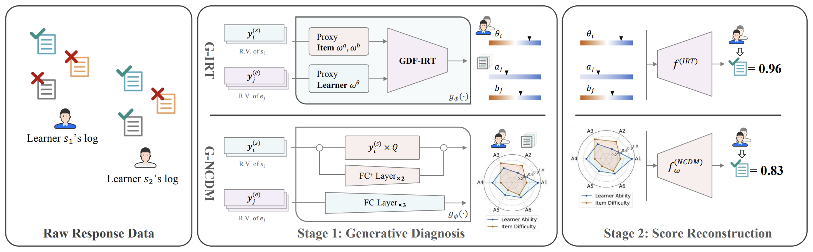
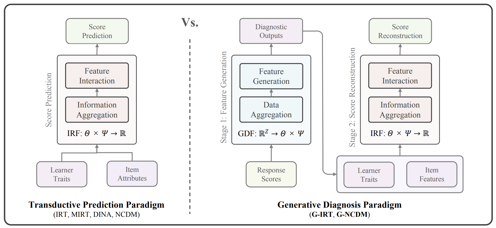

<div align="center">
  <h1 align="center">Generative Cognitive Diagnosis</h3>

  <p align="center">
    A codebase for generative (<strong>instant</strong>) cognitive diagnosis.
    <br />
    <a href="https://arxiv.org/abs/2507.09831"><strong>Explore the paper »</strong></a>
    <br />
  </p>
</div>



## About The Project

Generative cognitive diagnosis is a new paradigm in the cognitive diagnosis (CD) task. Unlike traditional cognitive diagnosis models (CDMs) that model learners and test items by trainable parameters, generative CDMs model learners and test items via **generative diagnostic functions (GDFs)**. Analogically, generative CDMs are "encoder-decoder" models while traditional CDMs are "decoder-only" models. 



The encoder-decoder design of generative CDMs brings two significant advantages:
- **Instant diagnosis without training for new learners**. When new learners comes, their cognitive state estimation could be instantly obtained by directly inputting their response scores to the GDF and running the generation process, without retraining the whole model.
- **Reliability of diagnostic outputs**. The latent trait estimation of GDF is highly controllable because one can conveniently apply parameter mediation to the GDF. This leads to a comprehensive understanding of the explainability and causality between response data and cognitive states generated by GDF.


## Getting Started

### Installation
For G-IRT:
```bash
conda create -n girt python=3.10
conda activate girt
pip install -r ./GIRT/requirements.txt
```

For G-NCDM:
```bash
conda create -n gncdm python=3.10
conda activate gncdm
pip install -r ./GNCDM/requirements.txt
```

## Usage
### Training
#### G-IRT
All training scripts are included in `GIRT/scripts/train*`. Remember to change file paths to your local path.

#### G-NCDM
Training and fitting are integrated together. The scripts are included in `GNCDM/scripts/gncdm*`.

### Evaluation
#### G-IRT
All evaluation scripts are included in `GIRT/scripts/eval*`. Remember to change file paths to your local path.

#### G-NCDM
Training and fitting are integrated together. The scripts are included in `GNCDM/scripts/gncdm*`.

### Instant Diagnosis
We saved checkpoints of generative CDMs for quick start of instant diagnosis on the ASSIST and Math1 dataset.
#### G-IRT
Please refer to `GIRT/scripts/diagnose*`.

#### G-NCDM
Please refer to `G-NCDM/scripts/gncdm_*_diagnose.sh`


## Citation

Please feel free to use our code and cite the paper!

```bibtex
@misc{li2025generativecognitivediagnosis,
      title={Generative Cognitive Diagnosis}, 
      author={Jiatong Li and Qi Liu and Mengxiao Zhu},
      year={2025},
      eprint={2507.09831},
      archivePrefix={arXiv},
      primaryClass={cs.LG},
      url={https://arxiv.org/abs/2507.09831}, 
}
```